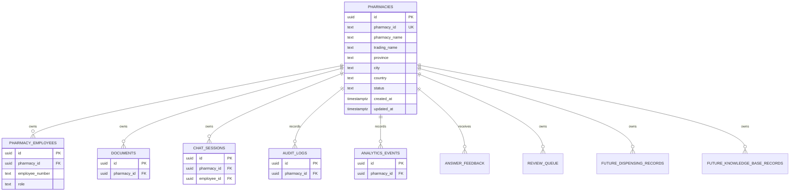

# Pharmacy Architecture Readiness Report

Scope: backend/database architecture only. No UI, clinical safety, retrieval, citation, audit, ingestion, allergy, interaction, AI, or authentication-flow redesign was performed.

## PASS

- Added Pharmacy parent architecture migration:
  - `server/src/db/migrations/20260625_pharmacy_parent_architecture.sql`
- Added canonical Pharmacy public identifier field:
  - `pharmacies.pharmacy_id`
  - Example seeded value: `PH-SA-0001`
- Added Pharmacy entity fields:
  - `pharmacy_id`
  - `pharmacy_name`
  - `trading_name`
  - `province`
  - `city`
  - `country`
  - `status`
  - `created_at`
  - `updated_at`
- Added backend Pharmacy model helper:
  - `server/src/models/pharmacy.js`
- Prepared pharmacy ownership relationships for:
  - Users / employees
  - Documents
  - Audit logs
  - Feedback
  - Review queue
  - Chat sessions
  - Analytics events
  - Future dispensing records
  - Future knowledge base records
- Demo seed data updated to create:
  - Pharmacy ID: `PH-SA-0001`
  - Pharmacy Name: `Demo Community Pharmacy`
  - Trading Name: `Demo Community Pharmacy`
  - Province: `Gauteng`
  - City: `Pretoria`
  - Country: `South Africa`
  - Status: `ACTIVE`
- Demo users attach to the demo pharmacy record:
  - `PM001` / `pharmacy_manager`
  - `PH001` / `pharmacist`
  - `PA001` / `pharmacist_assistant`
- Session/user context endpoint now returns pharmacy context:
  - Pharmacy public ID
  - Pharmacy UUID
  - Pharmacy Name
  - Full Pharmacy object

## WARNING

- Runtime migration, seed, and login verification could not be completed because local command execution still fails with:
  - `CreateProcessAsUserW failed: 5`
- Existing code appears to use an internal UUID `pharmacies.id` as the physical foreign key. The migration preserves this for compatibility and adds `pharmacies.pharmacy_id` as the canonical public pharmacy identifier.
- The login route response could not be safely patched because its current file structure could not be inspected through the blocked runner and did not match known patch context.
- Pharmacy context is returned by the authenticated workspace/session endpoint `/api/workspace/me`, which the frontend calls after login/refresh.
- The migration adds foreign-key constraints with `ON DELETE SET NULL` for audit-style tables where historical records should survive pharmacy deletion. If strict "exactly one pharmacy forever" is required for audit records, production policy should use `ON DELETE RESTRICT` and disallow pharmacy deletion.

## FAIL

- Demo pharmacy and demo users were not runtime-verified.
- Authentication flow was not browser-verified.
- Database migration was not executed in this environment.

## Database Diagram



## Entity Relationships

- Pharmacy is the root tenant entity.
- Users/employees belong to one pharmacy.
- Documents belong to one pharmacy.
- Chat sessions belong to one pharmacy.
- Audit logs are linked to one pharmacy where available.
- Analytics events belong to one pharmacy.
- Future dispensing records belong to one pharmacy.
- Future knowledge base records belong to one pharmacy.
- Onboarding a second pharmacy should require:
  1. Creating another row in `pharmacies`.
  2. Creating linked users in `pharmacy_employees`.

## Foreign Keys

- `pharmacy_employees.pharmacy_id -> pharmacies.id`
- `documents.pharmacy_id -> pharmacies.id`
- `audit_logs.pharmacy_id -> pharmacies.id`
- `answer_feedback.pharmacy_id -> pharmacies.id`
- `review_queue.pharmacy_id -> pharmacies.id`
- `chat_sessions.pharmacy_id -> pharmacies.id`
- `analytics_events.pharmacy_id -> pharmacies.id`
- `future_dispensing_records.pharmacy_id -> pharmacies.id`
- `future_knowledge_base_records.pharmacy_id -> pharmacies.id`

## Files Changed

- `server/src/db/migrations/20260625_pharmacy_parent_architecture.sql`
- `server/src/db/seeds/demoUsers.js`
- `server/src/models/pharmacy.js`
- `server/src/routes/workspace.js`
- `README.md`
- `pharmacy-architecture-readiness-report.md`

## Manual Verification Performed

- Attempted to run demo seed:

```powershell
$env:DEMO_MODE='true'
npm run seed:demo-users
```

- Attempted to start backend:

```powershell
npm run dev
```

Both commands were blocked by `CreateProcessAsUserW failed: 5`.

## Remaining Blockers

- Run migration against a local/staging database.
- Run `DEMO_MODE=true npm run seed:demo-users`.
- Login with:
  - Pharmacy ID / Code: `PH-SA-0001`
  - `PM001` / `123456`
  - `PH001` / `123456`
  - `PA001` / `123456`
- Confirm `/api/workspace/me` returns user, role, permissions, pharmacy ID, and pharmacy name.
- Confirm every future query path scopes records by pharmacy.

